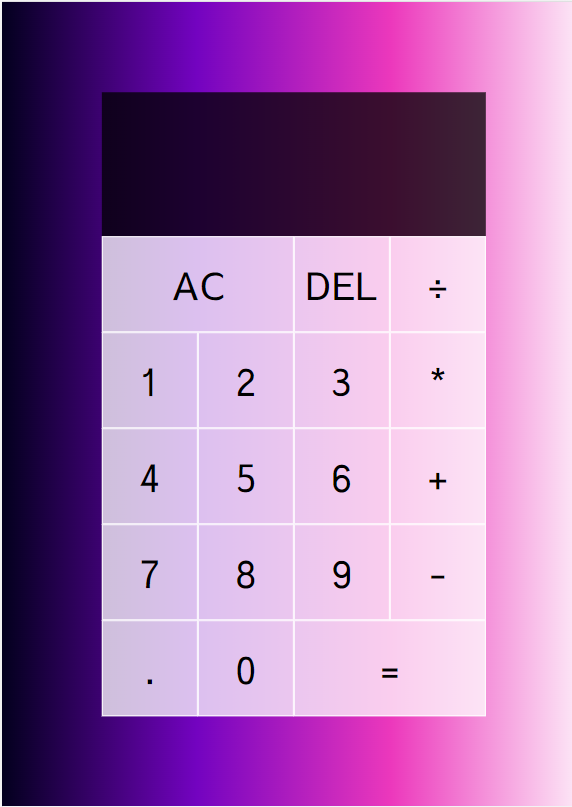

# Calculator App (3hrs)

### Time - 3hrs (including research and building logic)

### Major Learnings

- **Aligned** each button using just `display:grid`
- **Targetting** each button using Data attribute.
- **Used** Class based concept to design this complete app
- **This** app do simple operation like `addition`, `substraction`, `division`, `multiplication`.
- **This** also has feature to see previous operand and current operands

> [Github Link](https://github.com/abhishek7329sharma/CalculatorApp)

> [Live Link](https://legendary-squirrel-281159.netlify.app/)